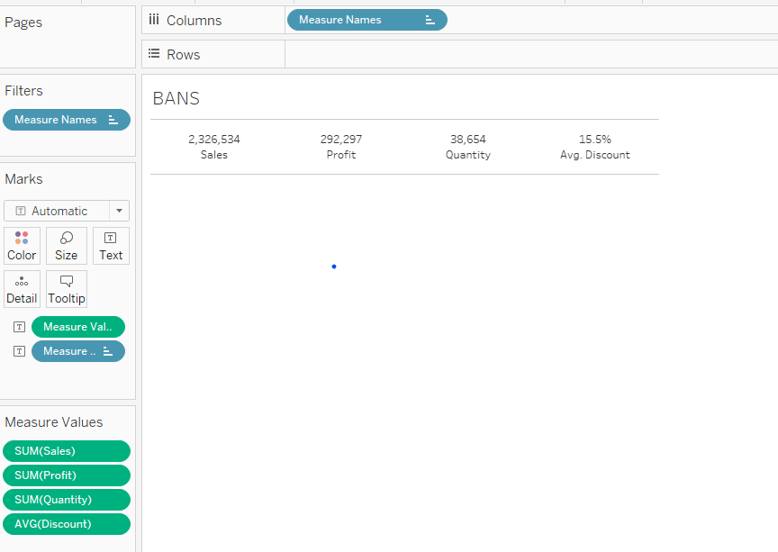

Alec Arnbrister

# Basic ideas on version control
*Just briefly what it is. Will be expanded later*

Think of version control as a way to track your changes and back up your files on an external server (technically known as a *remote*). There are many great benefits to this approach. Just to name a few:
* You won't need to worry about losing your computer or files. Since all the file are backed up on the remote, it can be retrieved anywhere as long as you have your credential.
* If you make changes to your files, the system will automatically track and highlight changes (technically known as *diffs*). So there's no need to add a timestamp to your file. For example, my_workbook_20Dec2024, my_workbook_26Dec2024, etc.
* No need to scratch your head and wonder what changes were about. For example, in what my_workbook_ddMMMyyy did I make this calculation? You can always view the log of changes you made or even restore to any previous version.
* Allow collaborations between different developers. Any one with appropriate permission can clone the project to their computer (technically known as a *local*), do their work, and push it up to the remote server for review and merge with your work to create the final product.

I've found these benefits are apparent especially when you need to work with different file types. For example, my dev stack includes
* Tableau workbooks
* Tableau Prep flows
* Data files in csv, excel, or hyper format
* Microsoft Access database
* Scripts (Python, SQL)
* Power Automate Desktop flows
* Along with several text or markdown files for various things such as notes, readme, etc.

# Set up NSI's git workflow
The purpose of this section is to set up NSI's dev workflow in gitlab.

<mark> You will need vscode and git bash installed on your machine. If not, please submit a ticket to IS3 </mark>

**Step 1: Create an access token**

An access token allows your machine to communicate with the gitlab server.

* Go to NSI's gitlab at https://gitlab.n-s-i.us
* Sign in by clicking on Azure SSO and select your NSI credential
* Click on your profile picture in the top left corner > Edit Profile > Access tokens
* Click on *Add new token* and then enter the token name (e.g., nsi_token). You can select all the checkboxes below and set expiration date (can't be more than 1 year).
* <mark> Immediately click on the paperclip icon to copy the token and save it to a text file somewhere on your machine (maybe in OneNote 😁). Do not close this box until you've coppied the token as you won't be able to retrieve it later. </mark>

**Step 2: Set git bash as my terminal**

git bash is a terminal in vscode that you'll use to track your changes. There are many choices for a terminal. For example, on a Mac, you'll probably use zsh. On Windows, there's WSL that is similar to zsh, but I've found that git bash is a lot easier to use. It's a terminal written by gitlab (the organization that host the remote server we're using) and is optimized specifically for version control.

* Open vscode
* Terminal > Integrated > Default Profile: Windows
    * The default terminal profile on windows is gitbash (make the choice)

**Step 3: Clone project from the remote to your machine**
* Navigate to https://gitlab.n-s-i.us/nsi/stac/tableau-vcs-example
* A few lines down, click on the blue button called **Code** > Clone with HTTPS > click on the paper clip.
* Go back to the gitbash terminal in vscode, type 
```
mkdir /c/git_repos
git clone <paste the coppied link>
```
* When using https for the first time to interact with gitlab, you will encouter a prompt for credentials: 
    * username (likely your NSI email) and password (the access token in step 1). 
    * If the credentials are correct, git will clone the project.

**Step 4: Open the project**
* In the git bash terminal, type ```code tableau-vcs-example --reuse-window``` to open the project in vscode.

At this point, you're inside your project. This is the vscode-way for navigating throughout your project:
* To the left is the EXPLORER dock that shows your project along with files in that it currently has.
* In the middle is the coding area. Files you open will most likely show up here.

# Basics of the git workflow
As an exercise to get used to the git workflow, please add your name at the beginning of this README and push it to the server.
* Go to the top of this README and type "<your_name> was here."
* Then go back to the terminal and type
```
git branch dev                                  # create a branch called "dev"
git switch dev                                  # switch to this "dev" branch
git status                                      # to see what changes were made
git add README.md                               # to tell git to track the changes you've made
git commit README.md -m "added this person"     # to provide a message of the changes you've made
git push                                        # to push changes to the remote, ready for review and merge
git push --set-upstream origin dev              # if this is the first time you push to the "dev" branch, you'll need to do this
```
Then on gitlab, project's maintaner(s) will be able to review the changes and accept the merge request.

# Basics of version control with Tableau
Tableau probably was originally built for data analyst, so version control was not built into the software. However, integrating version control into Tableau is beneficial as it will speed up development. Note that this type of version control is not the same as Tableau's revision history on the server, which is similar to saving the workbook with different timestamp.

The basic idea of version control with Tableau is to convert the workbook into an XML text-based file. Then changes to the file can be seen by inspecting the XML file. This can be done for Tableau workbooks as well as Tableau Prep files. Given a Tableau workbook called my_workbook.twb, below are steps to extract the XML file if one wishes to do it manually:
1. Save it as a twbx file, my_workbook.twbx
2. Rename it to my_workbook.zip
3. Unzip my_workbook.zip to folder my_workbook. Inside my_workbook folder, there is a file called my_workbook.twb (and possibly something else like a folder but I don't care about that)
4. Rename my_workbook.twb to my_workbook.txt. This is the XML text-based file we'll use to view changes.

The script **git_tab.sh** in this tutorial automates this process for both Tableau workbook and Tableau Prep flows. To use it, do the following in the terminal:
* Type ```chmod +x git_tab.sh```
* Type ```nano ~/.bashrc```. This will open up a text editor window.
* Type ```export PATH=$PATH:/c/git_repos/tableau-vcs-example```
* Press Ctrl + X, then Y (for Yes), and enter.
* Restart vscode by closing and reopening it.

You're now ready to do version control with Tableau. 

## Exercise 1: First commit 
As an exercise, we'll develop the following dashboard


The dataset *Sample - Superstore.xls* along with a starter Tableau workbook *executive_dashboard.twb" has been provided. Let's use **git_tab.sh** to view the XML structure behind the workbook.
* Start Tableau, connect to the data source, and drag the table *Orders* into the canvas
* Save the workbook.
* Save it as twbx and close the workbook.
* In the terminal, type ```git_tab.sh executive_dashboard.twbx```. The twbx workbook will be replaced by a txt file. This is the XML file containing the structure of the Tableau workbook.
* To see it, type ```code executive_dashboard.txt```.

At this point, it's maybe a good idea to make a commit since the idea behind version control is to make small, commitable changes that can easily be reviewed. Go to the terminal and type
```
git add executive_dashboard.twb executive_dashboard.txt
git commit -m "initial dashboard design"
git push
```
Now your changes have been commited on gitlab, pending for review and merge.

## Exercise 2: Make a change!
Let's build the first visualization, the KPIs, and see how the changes reflected in the XML file.

Here, I built the KPI sheet



Next, let's repeat the process:
* In the terminal, type ```start executive_dashboard.twb``` to open up the workbook.
* Save the workbook.
* Save it as twbx and close the workbook.
* In the terminal, type ```git_tab.sh executive_dashboard.twbx```.
* To see it, type ```code executive_dashboard.txt```.
    * In the popup text file, you'll see some color code that depicts the changes (i.e., what were added, what were removed, etc.). If this is hard to see, vscode offers color highlighting feature to see the diffs even easier -- in the top right corner, look for a symbol called *Open Changes*. 
    * Once you get used to git bash, another way to see the changes is via the command ```git diff <file_name>```
    * Note: this is another reason why doing version control in git and vscode is so awesome -- vscode has tons of features and extensions to make dev work convenient.

Looking at the diff, I can see *Sheet 1* was removed and *BANS* sheet was added. I also kinda see how the *BANS* sheet was built. For example, the Discount field was in the Columns shelf and the aggregation used on it was average (derivation='Avg'). Going further down the diff, I can only see that some formatting was used on the Discount field. If this looks good, it's time to make a commit.

```
git add executive_dashboard.twb executive_dashboard.txt
git commit -m "initial build of the BANs"
git push
```

## Exercise 3: Let's collaborate!
Looking back, Exercise 1 & 2 were designed to get used to version control with Tableau. There was no collaboration between developers -- all of the commits were made by yourself. In this exercise, you'll start with a workbook I already worked on and pushed to the remote. We then take turn to build each part of the dashboard until we have the dashboard sketch we did earlier.

First, do the following
```
cp archive/executive_dashboard_test.twb executive_dashboard.twb
cp archive/executive_dashboard_test.txt executive_dashboard.txt

git add executive_dashboard.twb executive_dashboard.txt
git commit -m "received the dashboard Huy built"
```

Now, let's take turn to build the visual elements of the dashboard.

# Final notes
The git workflow might look clumsy at first, but the more you use it, the more benefits you'll realize. The STAC team is committed to deploy the full git workflow on gitlab (so-called Continuous Integration / Continuous Development or CI/CD) that streamlines this process even further. Furthermore, chatbots powered by a Large Language Model (LLM) can be used to analyze the diff and return human-like text, which can make the workflow more efficient.

Doing it correctly, overtime Tableau workbooks and Tableau flows can be treated as company's digital assets. **git_tab.sh** script can then be used to parse all Tableau-related files into XML files, which then can be fed into LLM system for querries and analysis. For example, "What formula was used to calculate the FMC, MC, and NMC rate?" Or "Is there any dashboard or work related to Time On-Wing metric we did in the past that can be used to build NSI's analytics profile or as part of a contract bid?" This might be the first step that turn us into an AI company!

-- Tutorial written by Huy Truong