## Step 1: Set up and Configure your Workflow

Please do the following: 
* Set up a GitHub account
* Install the latest version of Visual Studio Code (referred as **vscode** for short)

Do the following only if you want to use command line.

* For Windows users only: Install the latest version of Git Bash. Then set Git Bash as the default terminal
    * Open vscode
    * Press Ctrl + ` (backtick is the key to the left of keyboard 1) to open a terminal.
    * Click on the down arrow next to + then choose Select Default Profile. You will see a dropdown at the top of the screen. Select Git Bash.
    * Close vscode and reopen it. Git Bash is now your default terminal. You can check this by clicking on the down arrow next to +. You should see Git Bash (Default)
* For Mac users only:
    * Open vscode
    * Press Ctrl (not Command) + ` (backtick is the key to the left of keyboard 1) to open a terminal.
    * Install Homebrew, which is a package manager for Mac.
    * Install git via the command, `brew install git`.
    * Check if git has been installed via the command, `git --version`.
    * Install Oh My Zsh via the command.

## Step 2: Clone This Project

* Navigate to https://github.com/huyptruong/tableau-vcs-example 
* A few lines down, click on a green button called **Code** > Local HTTPS > click on two overlapped squares to copy the link.
* Go back to the Git Bash terminal and type in the following
```
mkdir git_repos
cd git_repos
git clone <https://github.com/huyptruong/tableau-vcs-example >
```
* You may need to provide your credentials
    * Username
    * Password

## Step 3: Open the Project

* In the git bash terminal, type ```code tableau-vcs-example --reuse-window``` to open this project in vscode.
    * If it doesn't work, Open the Command Palette (Cmd + Shift + P)
    * Type and select Shell Command: Install 'code' command in PATH.
    * This should set up the code command in your system’s PATH.
* Press Ctrl + W to close the Welcome window.
* In the terminal, type ```cd tableau-vcs-example```
* At this point, you're in the directory of this project
    * To the left is the EXPLORER dock that shows your project along with files in that it currently has.
    * In the middle is the coding area. Files you open will most likely show up here.

## Step 4: Basics of Doing Version Control with Tableau Workbooks

*Note that this type of version control is not the same as Revision History feature you may have on your Tableau server or Tableau Cloud. Revision history is similar to saving the workbook with different timestamps.*

The basic idea of doing version control with Tableau is to convert the workbook or the prep flow to an XML-based text file. Then changes to the Tableau file can be viewed by inspecting the XML file. Given a Tableau workbook called executive_dashboard.twb, below are the steps to extract the XML-based file from it if we wish to do it manually:
1. Open executive_dashboard.twbx.
2. Save it as a twbx file, executive_dashboard.twbx.
3. Rename it to executive_dashboard.zip
4. Unzip executive_dashboard.zip to a folder called executive_dashboard. Inside this folder, you'll see the workbook, executive_dashboard.twb, along with other folders or files. For example, if your workbook connects to a local data source such as this one (Sample - Superstore.xlsx), you'll see a folder called Data that has this data source in it. However, if your workbook connects to a data source on a server, then there's nothing in this folder.
5. Rename executive_dashboard.twb to executive_dashboard.txt. This is the XML-based file we'll use to view changes.

The script **git_tab.sh** in this tutorial automates this process for both Tableau workbook and Tableau Prep flows. It clean up redundant files to free up some space. Once you run this script, vscode's EXPLORER window will show a .txt file next to the .twb file. Some basic setup steps are needed to use it effectively. In the terminal, do the following:
1. Type ```chmod +x git_tab.sh```
2. Type ```echo "export PATH=\$PATH:$(pwd)"```. Then copy the output. It should look something like this, ```export PATH=$PATH:/c/git_repos/tableau-vcs-example```
3. Type ```nano ~/.bashrc```. This will open up a text editor window.
4. Copy/Paste the output in step 2. Press Ctrl + X, then Y (for Yes), and enter.
5. Back to the terminal and type ```source ~/.bashrc```

After this step, you'll be able to call **git_tab.sh** anywhere. You're now ready to do version control with Tableau.

# Tableau Version Control Example

As an exercise, we'll build the following dashboard along with doing version control on it. This dashboard comes from the following site, https://workout-wednesday.com/2020w53/

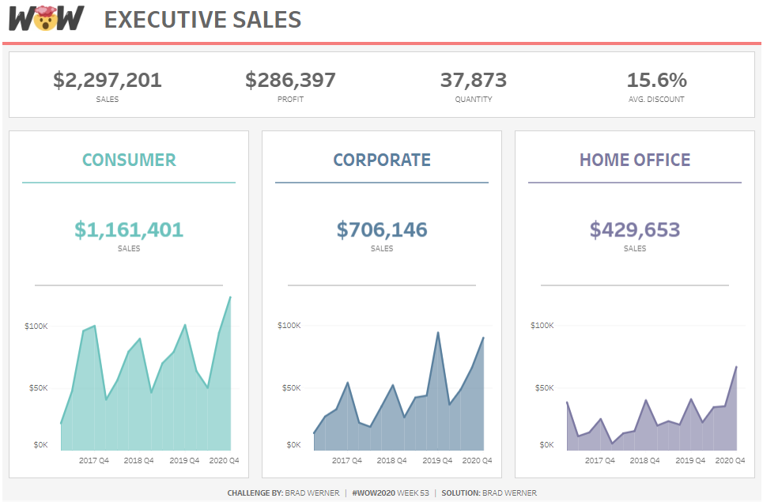

Although the dashboard is relatively simple, the idea behind this exercise is not to build it one stroke. Rather we'll break it down into small portions that can be built easily with traceable commits. At a glance, the dashboard is composed of the KPI and some line charts that serve as the core visualization. The following exercises outline the steps to build them:
1. Exercise 1: Make the First Commit. Build the KPI sheet. No formatting is needed.
2. Exercise 2: Enahnce the KPI Viz. Improve the KPI sheet with all the formatting as shown in the final dashboard.
3. Exercise 3: Finish the Core Viz. Build the line charts since they look all similar.
4. Exercise 4: Complete the Prototype Dashboard. Build the dashboard shown above.
5. Bonus Exercise: Resolve a Merge Conflict. Simulate a merge conflict on Tableau workbooks and discuss a strategy to resolve it.

## Excercise 1: Make the First Commit

In this exercise, we'll build the KPI sheet as our first visualization and commit it. No formatting is required.

As a good development practice, we will create a branch to work on this visualization. In the terminal, type `git checkout -b kpi`. We are now on a separate branch called *kpi*. Work on this branch won't affect the main branch.

Now, open the Tableau workbook with the following command, `start executive_dashboard.twb`, and build the visualization as shown below.

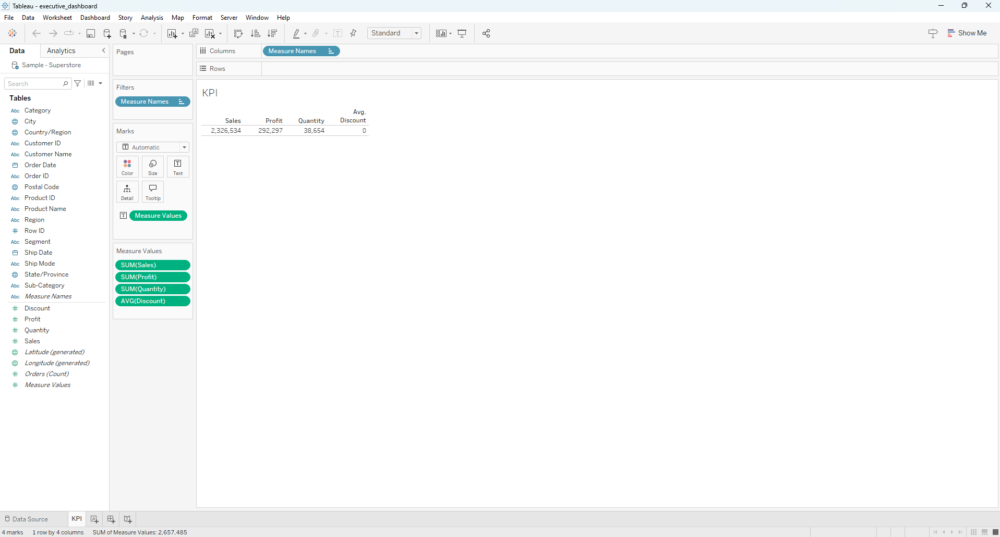

We're ready to make our first commit!
* Save the workbook
* Export it as a twbx. <strong style="color:red;">This step is important for version control.</strong>
* Close the workbook
* In the terminal, type ```git_tab.sh executive_dashboard.twbx```.
* To view it, type ```code executive_dashboard.txt```.
    * The txt file contains the workbook's structure as xml. Ctrl + F to search for the word *KPI* and you can see how the KPI sheet was built.
    * For instance, the aggregation used on Discount was average, while on Sales was sum (look for the word *derivation*).
* To commit, type the following to the terminal:
```
git add executive_dashboard.twb executive_dashboard.txt
git commit -m "KPI sheet initial build"
git switch main
git merge kpi # an input window might appear, but you can just close it
```

## Exercise 2: Enhance the KPI Viz

In this exercise, we will enhance the KPI viz with all the formatting. Do the following in the terminal
```
git switch kpi # switch back to the kpi branch
start executive_dashboard.twb
```
Then format the KPI viz as shown below

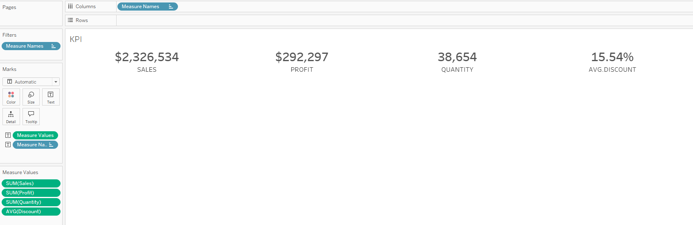

We're ready to make our second commit!
* Save the workbook
* Export it as a twbx
* Close the workbook
* In the terminal, type ```git_tab.sh executive_dashboard.twbx```.
* To view it, type ```code executive_dashboard.txt```.
    * In the popup text file, you'll see some color coding that depicts the changes (i.e., wha was added, what was removed, etc.). If this is hard to see, vscode offers a color highlighting feature to see the diffs even easier -- in the top right corner, look for a symbol called *Open Changes*. 
    * Once you get used to git, another way to see the changes is via the command ```git diff <executive_dashboard.txt>```.

<mark>Notice</mark> how the sub-text (SALES, PROFIT, etc.) was capitalized by changing their aliases. Because there are many ways to achieve the same result in Tableau, it’s not immediately obvious how this was done just by looking at the sheet. This highlights another benefit of using version control in Tableau: an analyst can quickly understand how something was accomplished. Such knowledge is essential for successfully executing mid- to large-scale Tableau projects, where tracking and maintaining existing work is just as important as adding new features. In these projects, even small change requests can feel overwhelming because of the sheer number of calculated fields that may have been created. The last thing anyone wants is to add more calculations just to achieve a desired format.

Relying on a sheet’s caption feature is clearly inadequate, simply because not everyone remembers to document their work. Personally, I have seen very few Tableau workbooks with good captions. Our minds are often too busy with other tasks!

Finally, don't forget to commit and merge to the main branch
```
git add executive_dashboard.twb executive_dashboard.txt
git commit -m "enhance KPI sheet with formats"
git switch main
git merge kpi # an input window might appear, but you can just close it
```

## Exercise 3: Finish the Core Visualizations

In this exercise, we finish the line charts and commit them to git. Start by creating a branch called *core_viz* and work on this branch, `git checkout core_viz`.

### Exercise 3.1: Consumer Chart and Number

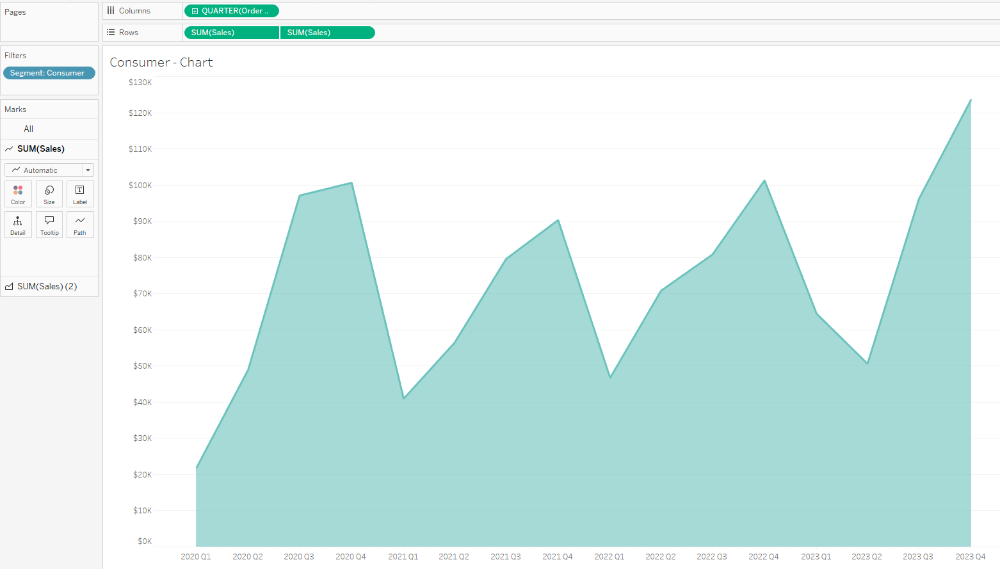
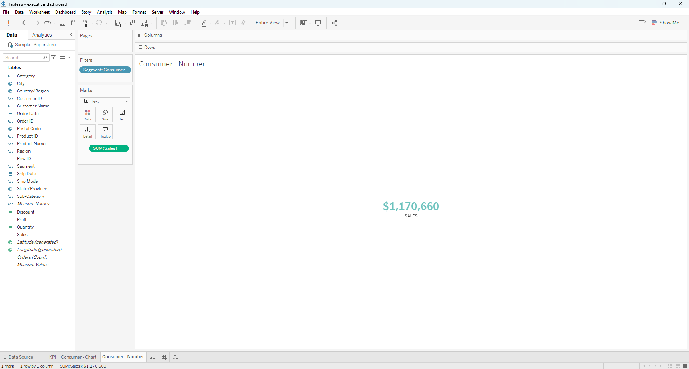

Follow the process in Exercise 2 to extract an XML-based file from the workbook and view the diffs with the *Open Changes* feature (top right corner). You can see that the information on filtering is encoded in the filter class. For example, the filter (Segment: Consumer) is shown as `member='&quot;Consumer&quot`.
* Save the workbook
* Export it as a twbx
* Close the workbook
* In the terminal, type ```git_tab.sh executive_dashboard.twbx```.

Don't forget to commit the changes!
```
git add executive_dashboard.twb executive_dashboard.txt
git commit -m "added the consumer chart and sales number"
```

### Exercise 3.2: Corporate Chart and Number
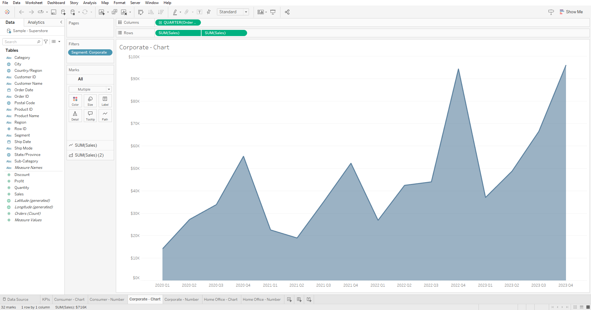
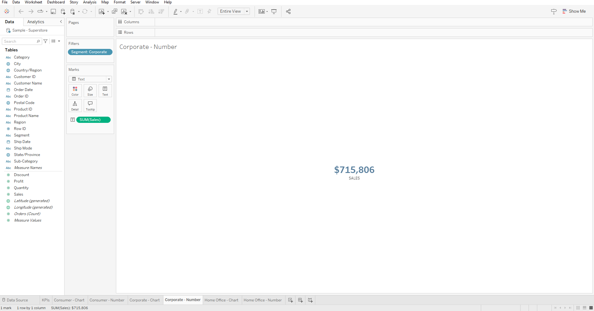

* Save the workbook
* Export it as a twbx
* Close the workbook
* In the terminal, type ```git_tab.sh executive_dashboard.twbx```.
```
git add executive_dashboard.twb executive_dashboard.txt
git commit -m "added the corporate chart and sales number"
```

### Exercise 3.3: Home Office Chart and Number
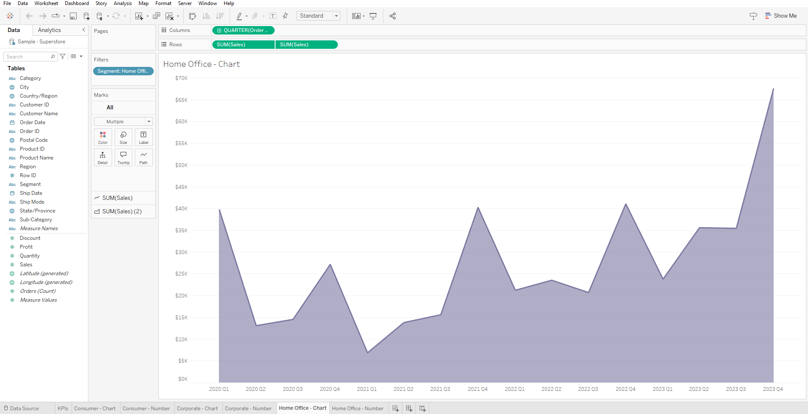
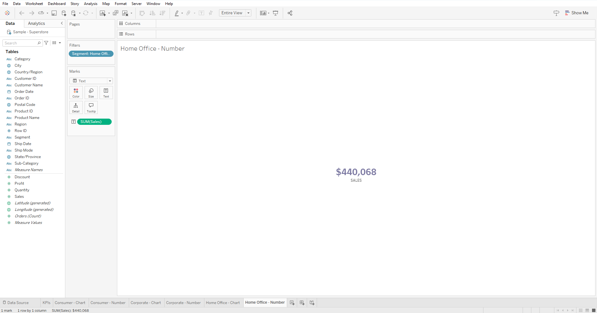

* Save the workbook
* Export it as a twbx
* Close the workbook
* In the terminal, type ```git_tab.sh executive_dashboard.twbx```.
```
git add executive_dashboard.twb executive_dashboard.txt
git commit -m "added the home office chart and sales number"
```

Finally, merge *core_viz* to main branch
```
git switch main
git merge core_viz # an input window might appear, but you can just close it
```

## Exercise 4: Complete the Prototype Dashboard

In this exercise, we finish prototyping the dashboard and commit it to git. Start by creating a branch called *dashboard-prototype* and work on this branch, `git checkout dashboard-prototype`

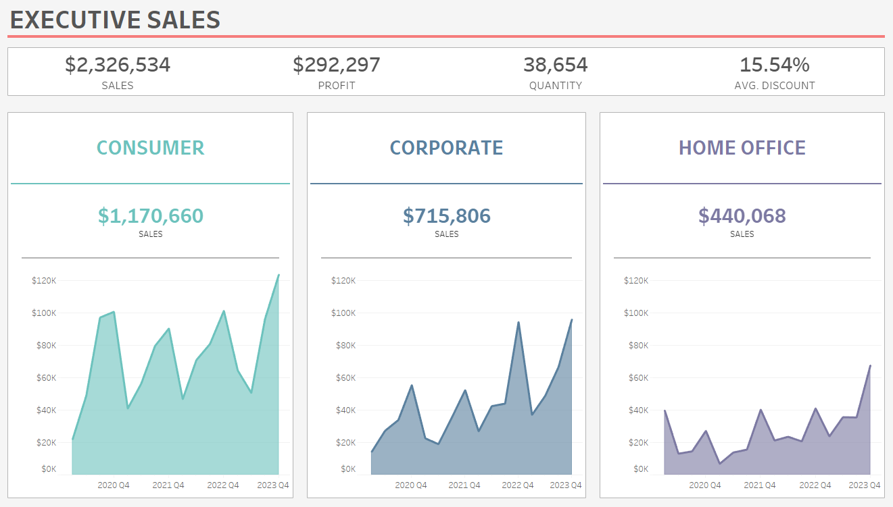

Follow the process in Exercise 3 to extract an XML-based file from the workbook and view the diffs with the *Open Changes* feature (top right corner). You can see that information about the dashboard is contained within the <dashboard> tag. Information on the dashboard's configuration is also provided.
* Save the workbook
* Export it as a twbx
* Close the workbook
* In the terminal, type `git_tab.sh executive_dashboard.twbx`.
```
git add executive_dashboard.twb executive_dashboard.txt
git commit -m "added the prototype dashboard"
```

Finally, merge *dashboard-prototype* to main branch
```
git switch main
git merge dashboard-prototype # an input window might appear, but you can just close it
```
## Bonus Exercise: Resolve a Merge Conflict

*To simplify the tutorial, this section relies more on code than previous section.*

As you collaborate with teammates on Tableau projects, eventually you will run into *merge conflicts*. As the name suggest, a merge conflict happens when git doesn't know how to merge work together. The diagram below demonstrates such an example

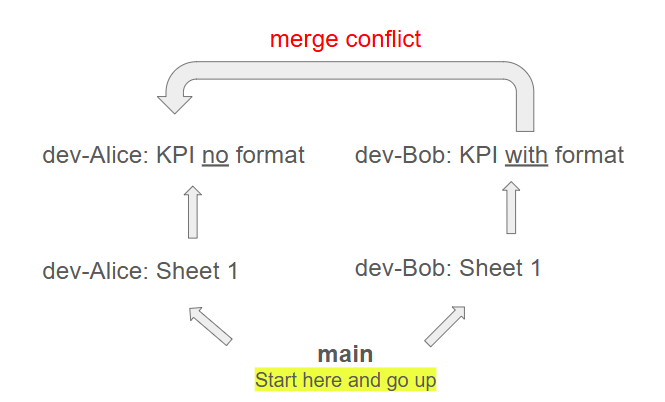

In this scenario, two developers Alice and Bob both want to build the KPI viz in two different ways. (We won't discuss why they simultaneously build the viz as the purpose of this exercise is raise awareness of merge conflicts only.) They start by splitting off from the main branch and build up the viz from a blank sheet, Sheet 1. Alice, essentially completing Exercise 1, build the viz without any format. Bob, on the other hand, completes the viz with all the required format (Exercise 2). Alice then wants to merge Bob's work into hers but a merge conflict happens because git doesn't know how to combine the two. After a meeting, they agree to finalize the KPI viz by using Bob's work.

Follow the code below to understand a merge conflict.
```
# Copy/Paste the file here
# It'll serve as the starting point (before the divergence)
git switch main
cp bonus/merge_conflict_practice.twb ./merge_conflict_practice.twb

# Simulate the situation when a person, Alice, takes a branch from main 
git switch main
git checkout -b dev-Alice

# Simulate the situation when another person, Bob, takes a branch from main 
git switch main
git checkout -b dev-Bob

# Alice creates the KPI viz with no format done and then commits it
git switch dev-Alice
start merge_conflict_practice.twb # open this Tableau workbook, modify Sheet 1 so it becomes the KPI sheet with no format (exercise 1), then save it as KPI
git_tab.sh merge_conflict_practice.twbx
git add merge_conflict_practice.twb merge_conflict_practice.txt
git commit -m "KPI initial build by Alice; no format"

# Bob creates the KPI viz with format and then commmits it
git switch dev-Bob
start merge_conflict_practice.twb open this Tableau workbook, modify Sheet 1 so it becomes the KPI sheet with the format (exercise 2), then save it as KPI
git_tab.sh merge_conflict_practice.twbx
git add merge_conflict_practice.twb merge_conflict_practice.txt
git commit -m "KPI initial build by Bob; with format"

# Switch to Alice branch and merge Bob's work into it
# There will be a conflict as git won't know how to merge two files
# Click on merge_conflict_practice.txt to look at where the conflict happens 
git switch dev-Alice
git merge dev-Bob # conflict will arise due to the format in Bob's workbook

# This abort the merge, essentially returns the twb and txt to their stage before the merge
git merge --abort

# Tell git to keep the version from Bob
git checkout --theirs merge_conflict_practice.twb merge_conflict_practice.txt
git add merge_conflict_practice.twb merge_conflict_practice.txt
git commit -m "alice likes bob's version since bob's already figured out how to format the KPIs"
```