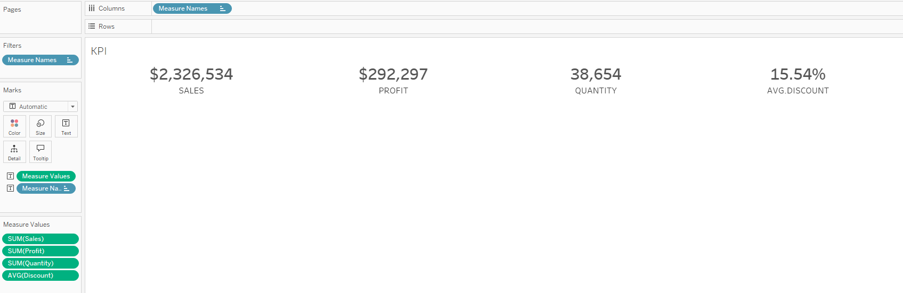
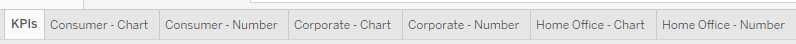

## Step 1: Set up and Configure your Workflow

Please do the following: 
* Set up a GitHub account
* Install the latest version of Visual Studio Code (referred as **vscode** for short)

Do the following only if you want to use command line.

* For Windows users only: Install the latest version of Git Bash. Then set Git Bash as the default terminal
    * Open vscode
    * Press Ctrl + ` (backtick is the key to the left of keyboard 1) to open a terminal.
    * Click on the down arrow next to + then choose Select Default Profile. You will see a dropdown at the top of the screen. Select Git Bash.
    * Close vscode and reopen it. Git Bash is now your default terminal. You can check this by clicking on the down arrow next to +. You should see Git Bash (Default)
* For Mac users only:
    * Open vscode
    * Press Ctrl (not Command) + ` (backtick is the key to the left of keyboard 1) to open a terminal.
    * Install Homebrew, which is a package manager for Mac.
    * Install git via the command, `brew install git`.
    * Check if git has been installed via the command, `git --version`.
    * Install Oh My Zsh via the command.

## Step 2: Clone This Project

* Navigate to https://github.com/huyptruong/tableau-vcs-example 
* A few lines down, click on a green button called **Code** > Local HTTPS > click on two overlapped squares to copy the link.
* Go back to the Git Bash terminal and type in the following
```
mkdir git_repos
cd git_repos
git clone <https://github.com/huyptruong/tableau-vcs-example >
```
* You may need to provide your credentials
    * Username
    * Password

## Step 3: Open the Project

* In the git bash terminal, type ```code tableau-vcs-example --reuse-window``` to open this project in vscode.
    * If it doesn't work, Open the Command Palette (Cmd + Shift + P)
    * Type and select Shell Command: Install 'code' command in PATH.
    * This should set up the code command in your system’s PATH.
* Press Ctrl + W to close the Welcome window.
* In the terminal, type ```cd tableau-vcs-example```
* At this point, you're in the directory of this project
    * To the left is the EXPLORER dock that shows your project along with files in that it currently has.
    * In the middle is the coding area. Files you open will most likely show up here.

## Step 4: Basics of Doing Version Control with Tableau Workbooks

*Note that this type of version control is not the same as Revision History feature you may have on your Tableau server or Tableau Cloud. Revision history is similar to saving the workbook with different timestamps.*

The basic idea of doing version control with Tableau is to convert the workbook or the prep flow to an XML-based text file. Then changes to the Tableau file can be viewed by inspecting the XML file. Given a Tableau workbook called executive_dashboard.twb, below are the steps to extract the XML-based file from it if we wish to do it manually:
1. Open executive_dashboard.twbx.
1. Save it as a twbx file, executive_dashboard.twbx.
2. Rename it to executive_dashboard.zip
3. Unzip executive_dashboard.zip to a folder called executive_dashboard. Inside this folder, you'll see the workbook, executive_dashboard.twb, along with other folders or files. For example, if your workbook connects to a local data source such as this one (Sample - Superstore.xlsx), you'll see a folder called Data that has this data source in it. However, if your workbook connects to a data source on a server, then there's nothing in this folder.
4. Rename executive_dashboard.twb to executive_dashboard.txt. This is the XML-based file we'll use to view changes.

The script **git_tab.sh** in this tutorial automates this process for both Tableau workbook and Tableau Prep flows. It clean up redundant files to free up some space. Once you run this script, vscode's EXPLORER window will show a .txt file next to the .twb file. Some basic setup steps are needed to use it effectively. In the terminal, do the following:
1. Type ```chmod +x git_tab.sh```
2. Type ```echo "export PATH=\$PATH:$(pwd)"```. Then copy the output. It should look something like this, ```export PATH=$PATH:/c/git_repos/tableau-vcs-example```
3. Type ```nano ~/.bashrc```. This will open up a text editor window.
4. Copy/Paste the output in step 2. Press Ctrl + X, then Y (for Yes), and enter.
5. Back to the terminal and type ```source ~/.bashrc```

After this step, you'll be able to call **git_tab.sh** anywhere. You're now ready to do version control with Tableau.

# Tableau Version Control Example

As an exercise, we'll build the following dashboard along with doing version control on it. This dashboard comes from the following site, https://workout-wednesday.com/2020w53/


## Excercise 1: Make the First Commit

For this exercise, we will build the KPI sheet as our first visualization and commit it. No formatting is required.

As a good development practice, we will create a branch to work on this visualization. In the terminal, type `git checkout -b kpi`. You are now on a separate branch called *kpi*. Work on this branch won't affect the main branch.

Now, open the Tableau workbook with the following command, `start executive_dashboard.twb`, and build the visualization as shown below.


We're ready to make our first commit!
* Save the workbook
* Export it as a twbx
* Close the workbook
* In the terminal, type ```git_tab.sh executive_dashboard.twbx```.
* To view it, type ```code executive_dashboard.txt```.
    * The txt file contains the workbook's structure as xml. Ctrl + F to search for the word *KPI* and you can see how the KPI sheet was built.
    * For instance, the aggregation used on Discount was average, while on Sales was sum (look for the word *derivation*).
* To commit, type the following to the terminal:
```
git add executive_dashboard.twb executive_dashboard.txt
git commit -m "KPI sheet initial build"
git switch main
git merge kpi # an input window might appear, but you can just close it
```
        
Let's build the first visualization, KPI, and see how the changes are reflected on the XML file. For this exercise, we will stop at 


The dataset *Sample - Superstore.xls* along with a starter Tableau workbook *executive_dashboard.twb" has been provided. Let's use **git_tab.sh** to view the XML structure behind the workbook.
* Start Tableau, connect to the data source, and drag the table *Orders* into the canvas
* Save the workbook.
* Also save it as a twbx in the same location. <strong style="color:red;">This step is important for version control.</strong>
* Close the workbook.
* In the terminal, type ```git_tab.sh executive_dashboard.twbx```. The twbx workbook will be replaced by a txt file. This is the XML file containing the structure of the Tableau workbook.
* To view it, type ```code executive_dashboard.txt```.

Now your work is on GitHub, ready for collaborators to pull to their local machine and work on it via the comment ```git pull```.

## Exercise 1: Building the KPI Viz

Let's build the first visualization, KPI, and see how the changes are reflected on the XML file.

As a good development practice, we will create a branch to work on this visualization. In the terminal, type `git checkout -b kpi`. You are now on a separate branch called *kpi*. Work on this branch won't affect the main branch.

Now, open the Tableau workbook with the following command, `start executive_dashboard.twb`, and build the visualization as shown below.



We're ready to make our first commit!
* Save the workbook
* Export it as a twbx
* Close the workbook
* In the terminal, type ```git_tab.sh executive_dashboard.twbx```.
* To view it, type ```code executive_dashboard.txt```.
    * In the popup text file, you'll see some color coding that depicts the changes (i.e., whawasre added, whatwase removed, etc.). If this is hard to see, vscode offers a color highlighting feature to see the diffs even easier -- in the top right corner, look for a symbol called *Open Changes*. 
    * Once you get used to git bash, another way to see the changes is via the command ```git diff <executive_dashboard.txt>```.


Looking at the diff, I can see *Sheet 1* was removed and *KPIs* sheet was added. I could also see how the *KPIs* sheet was built. For example, the Discount field was in the Columns shelf and the aggregation used on it was average (derivation='Avg'). Going further down the diff, I can only see that some formatting was used on the Discount field. If this looks good, it's time to make a commit.

```
git add executive_dashboard.twb executive_dashboard.txt
git commit -m "initial build of the KPIs"
git push
```

## Exercise 3: Finish the Core Visualizations

In this exercise, we finish the core visualizations and commit them to git. You should have something like this,




Follow the process in Exercise 2 to extract an XML-based file from the workbook and view the diffs with the *Open Changes* feature (top right corner). You can see that the information on filtering is encoded in the filter class. For example, the filter (Segment: Consumer) is shown as ```member='&quot;Consumer&quot```.

Don't forget to commit the changes!

## Exercise 4: Complete the Dashboard

In this exercise, we finish the dashboard and commit it to git.

Follow the process in Exercise 3 to extract an XML-based file from the workbook and view the diffs with the *Open Changes* feature (top right corner). You can see that information about the dashboard is contained within the <dashboard> tag. Information about the dashboard's configuration was also provided.

Don't forget to commit the changes!

## Exercise 5: Modify the KPIs Sheet 

In this exercise, we modify the KPIs sheet by applying lots of format on it. We also change the aggregation for the Discount field from SUM to AVERAGE, which is a more reasonable choice.

Follow the process in Exercise 3 to extract an XML-based file from the workbook and view the diffs. Notice the change in the aggregation from SUM to AVERAGE: SUM is highlighted as red to indicate a removal and AVERAGE is highlighted as green to indicate an addition.

Also notice how the sub-text (SALES, PROFIT, etc.) was capitalized by changing their aliases. Because there are many ways to achieve the same result in Tableau, it’s not immediately obvious how this was done just by looking at the sheet. This highlights another benefit of using version control in Tableau: an analyst can quickly understand how something was accomplished. Such knowledge is essential for successfully executing mid- to large-scale Tableau projects, where tracking and maintaining existing work is often more important than adding new features. In these projects, even small change requests can feel overwhelming because of the sheer number of calculated fields that may have been created. The last thing anyone wants is to add more calculations just to achieve a desired format.

Relying on a sheet’s caption feature is clearly inadequate, simply because not everyone remembers to document their work. Personally, I have seen very few Tableau workbooks with good captions. Our minds are often too busy with other tasks!

Finally, don't forget to commit the changes!